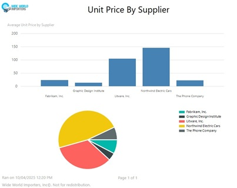

# Wide World Importers Reports

This project contains SSRS reports created from the Wide World Importers database.

## Features
The project features a variety of report styles including: 
* Paginated Reports
* Summary Reports
* Drilldown Reports
* Drillthrough Reports 
* SubReports
* Visualizations

## Setup
### Prerequisites
To view the reports, you'll need: 
* Access to a SQL Server
* The Wide World Importers data, available [here](https://learn.microsoft.com/en-us/sql/samples/wide-world-importers-oltp-install-configure?view=sql-server-ver16)
* Report Builder (availalbe [here](https://www.microsoft.com/en-us/download/details.aspx?id=53613)) or Visual Studio with a Microsoft Reporting Services Project extension installed

### Instructions

1. Download the .bak file, and restore it to SQL Server
2. Create the stored procedures (located in the SQLFiles Directory)
3. In Report Builder, of Visual Studio:
  * Open the report you want to view 
  * create a data source called "WorldWideImportersVS", and give it the connection string to your sql server.   
    * Example: Data Source="YourServer";Initial Catalog=WideWorldImporters
4. Click "Run" in report builder, or click the "Preview" tab in Visual Studio